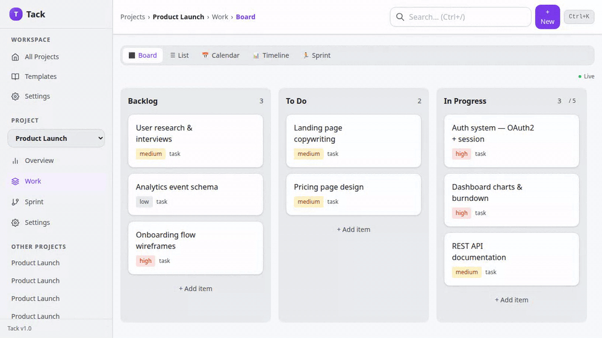
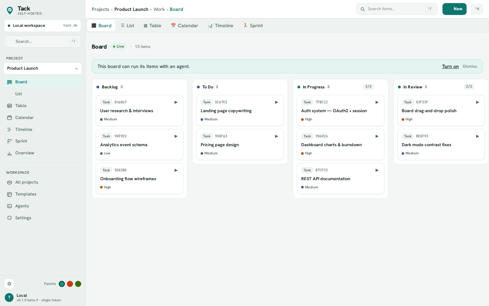
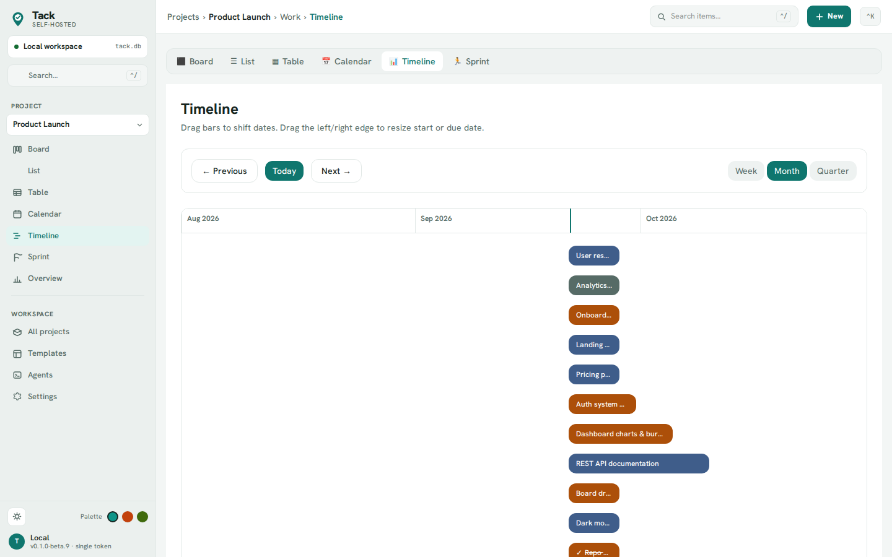
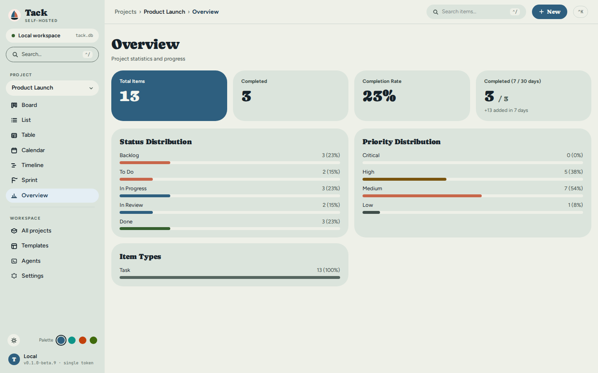
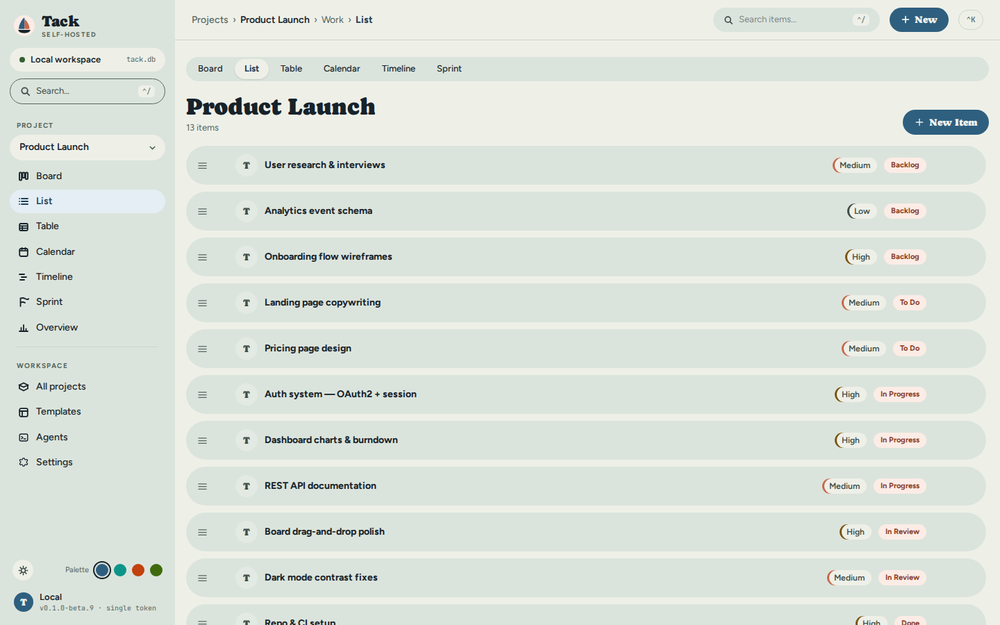
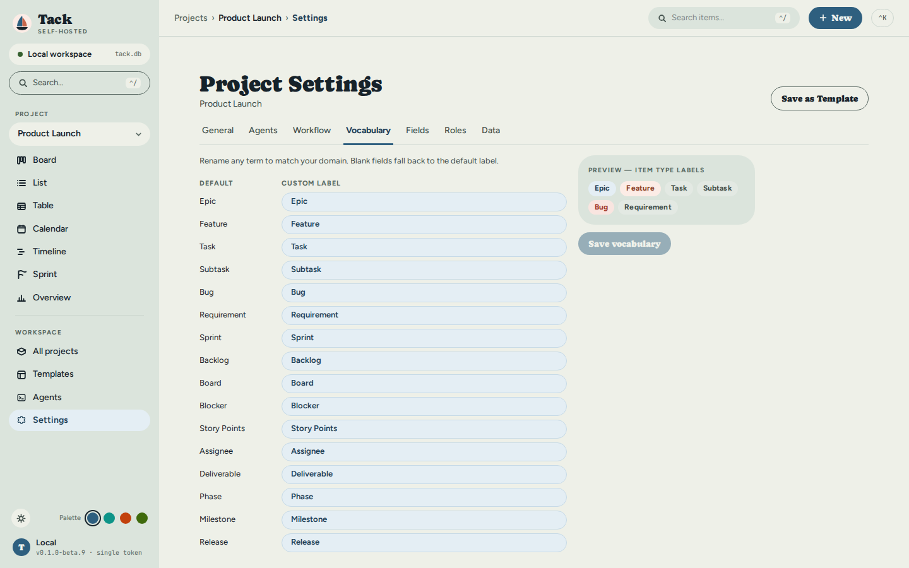

# Tack

[](https://github.com/yielab/tack/actions/workflows/ci.yml)
[](LICENSE)
[](https://www.rust-lang.org/)

**Tack** is a self-hosted project management tool that runs entirely from a single binary. Drop it on any machine, run it, and you have a full-featured project manager — web UI, REST API, and database all in one file. No Docker, no database server, no cloud accounts, no subscriptions.

Most project management tools force you into their workflow. Tack works the other way: you define the vocabulary and status columns that match your domain, and every surface — the UI, the CLI, and the API — adapts to your terms. The same tool works for a software sprint, a construction phase plan, a thesis outline, or a home renovation, without switching apps or losing context between projects.

**Your data stays on your machine.** Everything is stored in a single SQLite file next to the binary. Back it up by copying one file. Migrate by moving two files. No vendor lock-in, no sync, no network required to use your own data.

**AI-agent-ready.** `tack mcp` exposes the board to Claude Code, Codex, and any [MCP](https://modelcontextprotocol.io) client, so an agent can read, search, and update work — with the same workflow rules your team relies on.

Built with Rust (Axum + sqlx) and SolidJS.



<details>
<summary>More screenshots</summary>







</details>

---

## Why Tack

Most self-hosted PM tools are built on heavy multi-service stacks. Tack is one Rust
binary and one SQLite file — and it's **AI-agent-ready** out of the box.

| | **Tack** | Plane | Vikunja | Huly |
| --- | --- | --- | --- | --- |
| Built in | Rust | Python/Django | Go | TypeScript |
| Deploy | **single binary** | Docker Compose (multi-service) | single binary or Docker | Docker Compose (multi-service) |
| Runtime deps | **none** (embedded SQLite) | Postgres + Redis | SQLite / Postgres / MySQL | MongoDB + others |
| Idle footprint | **~12 MiB RSS** | hundreds of MiB | tens of MiB | hundreds of MiB |
| License | **MIT** | AGPL-3.0 | AGPL-3.0 | EPL-2.0 |
| First-class CLI | **yes** | no | partial | no |
| MCP server (AI agents) | **yes** (`tack mcp`) | yes | no | no |
| Per-project vocabulary | **yes** | no | no | no |

_Competitor details are best-effort from public docs/repos as of 2026-06; stacks
change. Footprints are order-of-magnitude. See [docs/BENCHMARKS.md](docs/BENCHMARKS.md)
for Tack's measured, reproducible numbers._

---

## Features

### Deployment

- **Single binary** — the web UI, REST API, and SQLite engine are all embedded in one ~10 MB statically-linked file
- **Zero dependencies** — no runtime, no database server, no container required; starts in milliseconds
- **Local data** — everything stored in `tack.db` + `storage/` next to the binary; back up by copying two files

### Views & Interface

| View | Description |
| --- | --- |
| **Board** | Kanban-style drag-and-drop with configurable columns and WIP limits |
| **List** | Sortable, hierarchy-aware list with inline editing and bulk operations |
| **Table** | Spreadsheet-style grid: inline-edit title/status/priority/assignee/due, sort, filter, and show/hide columns |
| **Calendar** | Items by due date — drag to reschedule |
| **Timeline** | Gantt-style view with dependency overlay — drag to reschedule |
| **Dashboard** | Throughput charts, status distribution, and sprint burndown |
| **Sprints** | Two-pane sprint planning (Backlog ↔ Sprint), capacity tracking |

- **Command palette** (Ctrl+K) and **global search** (Ctrl+/) available everywhere
- **Themes & palettes** — light/dark plus three accent palettes (Teal, Clay, Graphite), switched from the sidebar; WCAG AA contrast, verified in CI
- **Real-time updates** via WebSocket — open the same board in multiple tabs
- **Optimistic UI** — changes apply instantly, roll back on error
- Dark mode, skeleton loading screens, toast notifications

### Workflow & Project Types

- **10 project types** with pre-built workflows and vocabulary out of the box:

| Type | Default workflow | Vocabulary highlights |
| --- | --- | --- |
| `software` / `web` / `mobile` | Scrum | Epic, Feature, Task, Sprint |
| `construction` | Phase-based (Permit → Procurement → Build → Inspect → Handover) | Building, Work Order, Phase |
| `personal` | Simple (To Do → Doing → Done) | Goal, Action, Step |
| `homework` | Simple | Course, Assignment, Module, Week |
| `maintenance` | Kanban | System, Ticket, Job |
| `legal` | Phase-based (Intake → Discovery → Drafting → Review → Closed) | Matter, Case, Filing, Counsel |
| `research` | Kanban (Hypothesis → Design → Experiment → Analysis → Published) | Study, Experiment, Protocol, Researcher |
| `event` | Phase-based (Ideas → Booked → In Progress → Confirmed → Done) | Event, Track, Run Sheet |

- **Custom vocabulary** — rename any of 16 terms per project; the UI, CLI, and API all follow your terms
- **Custom workflows** — define any columns, WIP limits per column, and explicit transition rules
- **Dependency graph** — DAG with cycle detection; parent item auto-closes when all children reach done

### Data & Fields

- **Custom fields** — 9 types: Text, LongText, Number, Date, Boolean, Select, MultiSelect, URL, Email; with pattern / min / max validation
- **File attachments** — up to 50 MB per file, stored locally
- **Full-text search** — SQLite FTS5, scoped per project or global
- **Project templates** — built-in templates per type; save any project as a reusable template

### API & Integrations

- **64 REST endpoints** — full CRUD for all entities, search, export, and diagnostics
- **CLI client** — the same `tack` binary with `tack add`, `tack list`, `tack move`, `tack branch` (git branch from an item), and more; `--json` output and shell completions (bash/zsh/fish)
- **MCP server for AI agents** — `tack mcp` exposes the board to Claude Code, Codex, and any MCP client (list/search/read items, create/update/move, comment) over stdio; writes still pass through workflow validation. See [docs/MCP.md](docs/MCP.md)
- **Import** — GitHub Issues (public or private repos, label filter, PAT), Linear (GraphQL API, team/project filter), JSON/YAML round-trip, CSV
- **GitHub push sync** — set `TACK_GITHUB_TOKEN` and completing an imported item closes its GitHub issue (push-only v1). See [docs/GITHUB-SYNC.md](docs/GITHUB-SYNC.md)
- **Export** — JSON snapshot, plaintext **YAML** (git-diffable), and CSV per project
- **Backup / restore** — hot backup via `VACUUM INTO`; cloud backup to any S3-compatible bucket (Cloudflare R2, Backblaze B2, AWS S3); configurable from **Settings → Cloud Backup**
- **Webhooks** — outbound POST events on item changes and sprint transitions; HMAC-SHA256 payload signing

---

## Quick Start

**One line (Linux / macOS):**

```bash
curl -fsSL https://raw.githubusercontent.com/yielab/tack/main/install.sh | sh
tack            # starts the server + web UI at http://localhost:3210
```

**With Cargo** (builds the single binary with the UI embedded):

```bash
cargo install --git https://github.com/yielab/tack tack-cli --features embed-spa
```

**Or download** the archive for your system from the [releases page](https://github.com/yielab/tack/releases):

```bash
# Linux / macOS
tar xzf tack-*.tar.gz && cd tack-*/
./tack
```

**Windows:** extract the zip and double-click `tack.exe`.

Open **`http://localhost:3210`** in your browser. Your data lives in `tack.db` and a `storage/` folder next to the binary — back those two up and you've backed up everything.

> **First-run note:** the binary is not code-signed yet. On macOS, right-click → **Open** the first time (or `xattr -d com.apple.quarantine tack`). On Windows, click **More info → Run anyway** if SmartScreen appears.

---

## Status & Limitations

Tack is in **beta**. Core features are complete; a few constraints to know upfront:

| Area | Current state |
| --- | --- |
| Authentication | One shared optional Bearer token — no per-user accounts. Suited for solo use or a small trusted group on the same network. |
| Multi-user | No per-user identities or permissions. All API clients share the same access level. |
| Multi-device sync | Single server, single database. No replication between instances. |
| Mobile | Responsive web UI works on mobile browsers; no native app. |
| Binary signing | Not code-signed yet. See first-run note above. Roadmap item. |
| Offline | Browser UI requires the local server to be running. |

---

## Build from Source

**Prerequisites:** [Rust 1.75+](https://rustup.rs/) · [Node.js 20+](https://nodejs.org/)

```bash
git clone https://github.com/yielab/tack.git
cd tack
make build   # builds the frontend then embeds it into the release binary
make run     # starts the pre-built binary at http://127.0.0.1:3210
```

For development with hot reload:

```bash
make dev     # starts API + Vite dev server; open http://localhost:5173
```

Other commands:

```bash
make test         # all Rust tests (170 tests)
make e2e          # Playwright end-to-end tests (auto-starts servers)
make e2e-install  # one-time: download browser engines
make audit        # CVE scan (cargo audit + npm audit)
make lint         # clippy --workspace -- -D warnings
make fmt          # rustfmt --all
make help         # full command list
```

---

## Configuration

Configuration is loaded from `tack.toml` in the working directory, or from environment variables.

| Variable | Default | Description |
| --- | --- | --- |
| `TACK_HOST` | `127.0.0.1` | Bind address |
| `TACK_PORT` | `3210` | Port |
| `TACK_DATABASE_URL` | `sqlite:tack.db?mode=rwc` | SQLite path |
| `TACK_LOG_LEVEL` | `info` | `trace` · `debug` · `info` · `warn` · `error` |
| `TACK_STORAGE_DIR` | `./storage` | Attachment storage directory |
| `TACK_API_TOKEN` | _(none)_ | Bearer token — required on all `/api/*` requests when set |
| `TACK_WEBHOOK_URL` | _(none)_ | Outbound webhook destination |
| `TACK_WEBHOOK_SECRET` | _(none)_ | HMAC-SHA256 signing key for webhook payloads |
| `TACK_BACKUP_BUCKET` | _(none)_ | S3 bucket name — required to enable cloud backup |

See the full variable reference in the [Configuration guide](docs/book/src/developer/deployment.md).

---

## Architecture

```text
tack-core   Pure domain logic — models, workflow engine, vocabulary, dependency graph (no I/O)
    ↑
tack-db     SQLite persistence via sqlx — 17 migrations, FTS5, repository pattern
    ↑
tack-api    Axum HTTP server + WebSocket — 64 endpoints, config, webhooks (library crate)
    ↑
tack-cli    The `tack` binary — embeds tack-api to run the server; also the CLI client
```

The frontend is a SolidJS SPA embedded into the release binary via `--features embed-spa`. See the [Architecture overview](docs/book/src/developer/README.md) for details.

---

## Documentation

Full documentation is in [`docs/book/`](docs/book/). Build it locally with [mdBook](https://rust-lang.github.io/mdBook/):

```bash
cargo install mdbook
mdbook serve docs/book   # opens http://localhost:3000
```

| Guide | Description |
| --- | --- |
| [Quick Start](docs/book/src/user-guide/quick-start.md) | First-run walkthrough |
| [API Reference](docs/book/src/developer/api-reference.md) | All 64 endpoints with request/response shapes |
| [CLI Reference](docs/book/src/user-guide/cli.md) | Every `tack` subcommand |
| [MCP Server](docs/MCP.md) | Wire Tack into Claude Code / AI agents via `tack mcp` |
| [Configuration](docs/book/src/developer/deployment.md) | Full variable reference and `tack.toml` |
| [Architecture](docs/book/src/developer/README.md) | Crate boundaries, design decisions |
| [Benchmarks](docs/BENCHMARKS.md) | Measured footprint and latency, with repro steps |
| [Testing](docs/TESTING.md) | Unit, integration, E2E, load, and security tests |
| [Roadmap](docs/book/src/roadmap.md) | Planned features and known gaps |

---

## Contributing

See [CONTRIBUTING.md](CONTRIBUTING.md) for how to report bugs, propose features, and submit pull requests.

Before pushing, activate the pre-push hook that runs `fmt` and `clippy`:

```bash
git config core.hooksPath .githooks
```

---

## License

MIT — see [LICENSE](LICENSE).
