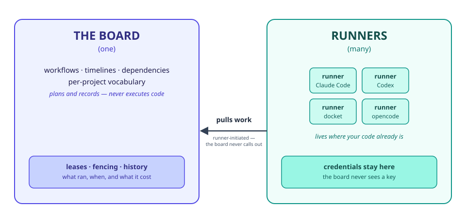

# Tack

[](https://github.com/yielab/tack/actions/workflows/ci.yml)
[](LICENSE)
[](https://www.rust-lang.org/)
[](CHANGELOG.md)

**A project board that can hand its own items to an AI coding agent — Claude Code or
Codex — and track the run as part of the item's history.** Self-hosted, one binary,
no cloud account.

<p align="center">
  
</p>

## What it is

In priority order — what Tack is built around, what it's built on top of, and what
it costs you to run:

- **An agent execution engine, first.** Assign any board item to `claude-code` or
  `codex` and it runs as a tracked, durable attempt — events, decisions, and
  artifacts land back on the item, not a fire-and-forget shell command. Most of
  this README is about this one capability, because it's the reason to pick Tack
  over a plain project tracker.
- **A full project manager underneath it.** Board, list, table, calendar, timeline,
  and dashboard views; configurable Scrum/Kanban/phase workflows; vocabulary you
  rename to match your domain (`Task` → `Work Order`, `Sprint` → `Phase`). None of
  this needs an agent turned on to be useful on day one.
- **Self-hosted, with nothing else to run.** One binary, one SQLite file. No
  accounts, no subscriptions, nothing running in someone else's cloud.

<p align="center">
  
  
</p>

## Running an agent

This is Tack's headline feature — the rest of this README is either the
project-manager surface that plans and displays the work, or the self-hosted
footprint that keeps all of it on your own infrastructure. The three parts below are
one story: how a run starts, exactly which agent and credential do the work, and what
happens when one gets killed halfway through.

### How it works

1. **Plan it on the board** — create an item, assign it to an agent profile, set its
   budget and policy.
2. **A runner picks it up where the code is** — it pulls the request, checks out an
   isolated workspace, and launches the harness with its own credentials.
3. **The run is recorded on the item** — events, decisions, and artifacts land back on
   the board as they happen, and the finished attempt stays in the item's history.

### Which agent runs it, on what model, and who pays for it

This is the part most agent tooling blurs together, so Tack keeps it as **three**
separate choices. They compose freely — picking one never silently picks another.

**1. The harness** — the coding agent CLI that actually runs. Today there are two,
each driven through a real adapter — not a hand-rolled prompt loop bolted onto an
API — behind one `HarnessAdapter` trait, so the next one is a new module, not a
rewrite:

- **Claude Code** (`claude-code`)
- **Codex** (`codex`)

A harness constrains exactly one thing about the model: **the wire protocol** it
speaks. Claude Code is pointed at an Anthropic-Messages endpoint through environment
variables; Codex at an OpenAI-Responses endpoint through invocation flags. That is a
property of the program, not a claim about whose models it can run — vendors are
properties of the endpoint ([ADR 0063](docs/adr/0063-harness-credential-modes.md)).

**2. The credential mode** — how that harness is authenticated, chosen per runner,
per harness. There are exactly two, never a third:

1. **Its own subscription.** The harness logs in the way you already log in —
   Claude Max/Pro, a ChatGPT plan through `codex login`. Tack never sees that
   credential and there's no per-attempt bill to track. **In this mode, and only
   this one, your plan is also what decides which models exist.**
2. **An API key against an endpoint**, held only by the runner — never the board,
   never its database — and injected straight into the subprocess at the moment
   it's spawned, never written to a config file on disk. A **gateway** (Vercel AI
   Gateway, which proxies dozens of vendors' models behind one key) and a vendor's
   **own direct API** (`api.anthropic.com`) are the same mode as far as Tack is
   concerned, just a different endpoint — switch between them from one field on
   the Agents page, with no restart and nothing to edit by hand.

**3. The model** — which model actually answers. In key+endpoint mode the harness you
picked does **not** decide this. The models on offer come from the endpoint's own
catalog, and Tack records that whole catalog against every harness whose wire the
endpoint serves. Running Claude Code against a gateway does not restrict you to
Anthropic models, and running Codex against one does not restrict you to OpenAI
models.

| Harness | Wire it speaks | Endpoints a runner-held key can point it at | Models offered there |
| --- | --- | --- | --- |
| **Claude Code** | Anthropic Messages | Vercel AI Gateway · Anthropic's own API | the gateway's full catalog · Anthropic's own model list |
| **Codex** | OpenAI Responses | Vercel AI Gateway | the gateway's full catalog |

Anthropic's own API is missing from the Codex row for a structural reason rather than
an unbuilt feature: it does not serve the OpenAI-Responses wire at all, so there is no
endpoint there to point Codex at.

Either way, the catalog is real, not hand-maintained — fetched live from that
provider's own endpoint, with price and context window shown only where the provider
actually publishes them, never estimated and never a silent `0` standing in for
"unknown." Which exact model a given request gets is a separate, deterministic
decision Tack makes server-side before a runner ever sees the request — the
[full precedence order](docs/book/src/user-guide/agent-runners.md#choosing-a-model-and-a-provider)
lives in the book.

### Durable by design

An attempt in progress can be killed — a crashed machine, a lost connection — without
losing track of it or silently running it twice. This is a runner killed mid-attempt
against a real server and a real lease: the attempt turns `needs_operator` with no blind
duplicate execution, an operator resolves it with an explicit decision, and the retry
succeeds.

<p align="center">
  
</p>

The recording is reproducible: [`scripts/record-recovery-demo.sh`](scripts/record-recovery-demo.sh)
drives it against a published release artifact in Docker, and [`scripts/smoke.sh` step
9](scripts/smoke.sh#L322-L409) asserts the same sequence on every run.

## Two components

Under the hood, Tack is two components, built to be one product.

<p align="center">
  <picture>
    <source media="(prefers-color-scheme: dark)" srcset="docs/diagrams/two-components-dark.svg">
    
  </picture>
</p>

> **The board** is the project manager: workflows, timelines, dependencies, per-project
> vocabulary — one binary, one SQLite file, no accounts, no cloud. It is the plan, the
> policy and the record. It decides *what* runs, *when*, under *which* limits, and it keeps
> the durable history of every run: events, decisions, artifacts, and what it measurably
> cost. **It never executes code and never holds a model credential.**
>
> **The runner** is a small worker that lives where the code and the credentials already
> are — a laptop, a CI box, a machine with a GPU. It pulls work from the board, checks out
> an isolated workspace, launches the coding agent you already use — Claude Code or Codex
> — and reports back. **It holds the keys; the board never sees them.**
>
> They are separate because they scale and fail differently. **One board, many runners:**
> a board on a small VPS dispatches to runners on ten developers' machines, each with its
> own agent, model and capacity. A runner that dies mid-run cannot corrupt the board — its
> lease expires and its fencing token stops writing. A board that restarts cannot lose a
> run — the runner's journal knows what it started. **One developer runs both in one
> process with one command**, on the same contract, with the same recovery.

| | The board | The runner |
| --- | --- | --- |
| What it does | Plans, schedules, and records | Checks out, launches the harness, reports back |
| What it holds | Workflow, policy, budgets, durable history | Credentials, workspace, the harness subprocess |
| How many | One | Many — one per machine with code and credentials |
| What happens when it dies | Restarts and loses nothing — the runner's journal knows what it started | Its lease expires, its fencing token stops writing; no duplicate, no silent loss |
| How you run it | `tack serve` | `tack serve --with-runner` (embedded) or `tack-runner` (separate binary, remote) |

**Jump to:** [Features](#features) · [Screenshots](#screenshots) ·
[Requirements](#requirements) · [Run it](#run-it) · [Status](#status) ·
[Architecture](#architecture) · [Documentation](#documentation) ·
[Contributing](#contributing)

---

## Why Tack

Tack isn't another agent framework and it doesn't replace the coding agent you
already trust. It's the layer between them: the thing that turns "run Claude Code
on this ticket" from a copy-paste-and-hope shell command into a governed,
auditable operation with a history.

| | Agent frameworks (LangGraph, CrewAI, AutoGen…) | Project trackers (Linear, Jira, Plane…) | **Tack** |
| --- | --- | --- | --- |
| Drives Claude Code / Codex for you | you wire the loop yourself | no — nothing executes | ✅ pull-based, out of the box |
| Survives a crash mid-run with no duplicate work | you build the fencing/lease logic | n/a, nothing runs | ✅ built in, [demonstrated](#durable-by-design) |
| Records cost, decisions, and full history per work item | you build the store | tracks the ticket, not the run | ✅ per attempt, measured not estimated |
| Self-hosted, no cloud account, no vendor lock-in | a library you host yourself | usually a hosted SaaS | ✅ one binary, one SQLite file |

If you already build agents with a framework, Tack is not a competitor to it — a
framework gives you primitives to construct an agent loop; Tack assumes you'd
rather point it at Claude Code or Codex, tools that already do that well, and
instead solves the problem those frameworks leave on the table: who ran what,
against which item, at what cost, with what to show for it when it crashes
halfway through.

## Features

Same priority order as above: the capability Tack is built around, the project
manager it's built on top of, and the surfaces for reaching either one from outside
a browser.

### Agent execution

The headline capability, and the reason this document leads with it. It needs at
least one runner attached — embedded (`tack serve --with-runner`) or a separate
`tack-runner` process — and one harness, Claude Code or Codex, installed and
credentialed on that runner's machine. [Running an agent](#running-an-agent) above
covers exactly which agent runs, how it's credentialed, and what happens when one
crashes mid-attempt; this list covers what else that buys you:

- Structured decisions for human-in-the-loop approval, and structured artifacts on
  every run — not a log dump to grep through
- Measured usage only — cost and token counts are shown as measured or explicitly
  **not measured**, never estimated or silently shown as zero
- One **Agents** page owns the path from an installed binary to a finished run: turn
  execution on without a restart or a flag, see which harnesses this machine has and
  whether their vendor login already works, paste a provider key, pick a default model
  from a real catalog, and dispatch a test run. Every status on it is earned by an
  observation, never asserted

### Project management

Works the moment `tack serve` starts, with zero configuration and no runner
attached — nothing below needs an agent to be useful:

- Configurable workflows — Scrum, Kanban, or phase-based — with per-project vocabulary
  so the UI, CLI, and API all speak the language of your domain
- Board, list, table, calendar, timeline, and dashboard views
- Hierarchical items, dependency DAGs with cycle detection, custom fields, comments,
  attachments, full-text search, templates, and bulk operations
- Realtime updates over WebSocket with optimistic UI
- JSON/YAML/CSV export, GitHub Issues and Linear import, hot and S3-compatible backup

### Automation surfaces

Ways to reach the board from outside a browser — a script, another agent, your own
CI, or a webhook consumer. None of these require agent execution to be turned on
either:

- A REST API described by a checked-in [OpenAPI spec](docs/openapi.json), plus a CLI
  with JSON output and shell completions
- `tack mcp` — lets Claude Code, Codex, and other MCP clients read and update the
  board through normal workflow validation
- Outbound signed webhooks and optional GitHub push sync
- A desktop app with a tray icon, and `tack service install` for a per-user background
  service — closing the window, or the terminal, does not stop the work

## Screenshots

The board and the Agents page are up top — these two carry the rest of the signal
that's specific to Tack rather than table stakes for any PM tool.

<p align="center">
  
  
</p>

**Timeline** is the dependency DAG that also gates agent eligibility — an item
blocked on an unfinished dependency isn't just visually behind a bar, it isn't
handed to a runner yet either. **Dashboard** applies the same "measured, not
estimated" rule the Agents page uses for run cost to project-level throughput.

<details>
<summary>Plain Kanban and list views, plus the vocabulary editor</summary>
<br>


</details>

## Requirements

Running a release binary needs nothing else: SQLite and the web UI are embedded in
the single `tack` binary — no Docker, no database server, no separate frontend build.

| | |
| --- | --- |
| **Platform** | Linux, macOS (Intel + Apple Silicon), Windows |
| **Browser** | Any current Chrome, Firefox, Safari, or Edge |
| **Footprint** | 21.0 MiB binary (UI embedded), ~19.5 MiB idle memory — measured in [Benchmarks](docs/BENCHMARKS.md) |

Building from source instead needs [Rust 1.94+](https://rustup.rs/) and
[Node.js 22+](https://nodejs.org/).

## Run it

### Do you need a runner?

Only if you want an item's **Run with agent** button to do something. Tack is two
things in one binary — a project manager that always runs, and an agent executor
that's off until something turns it on:

| Works with zero runners | | Needs an active runner | |
|---|---|---|---|
| Board, timeline, dashboard, list, calendar | ✅ | An item's **Run with agent** button | ❌ "Agent execution is off" |
| Items, comments, search, attachments | ✅ | Codex or Claude Code actually running | ❌ nothing to run it |
| CLI, REST API, `tack mcp`, webhooks, GitHub sync | ✅ | | |

Nothing silently queues forever — the button says there's no runner to give the
request to, instead of accepting one that no runner will ever claim.

**The analogy, if you've used a CI runner (GitHub Actions, GitLab):** the board is the
pipeline and its history, always there whether or not anything executes it. The
runner is the worker that attaches to it, runs eligible work near your own code and
credentials, and reports back. Zero runners attached is a normal working state, not a
broken one.

**Three ways to attach one**, in order of effort — the first two are the *same*
runner, just switched on at a different moment:

1. **`tack serve --with-runner`** — embedded, on from the first second. What every
   command below uses.
2. **The Agents page → Turn on** — same embedded runner, flipped on later with no
   restart, if you started plain `tack serve` instead.
3. **A separate `tack-runner` process**, enrolled against this board — needed for a
   shared or production deployment not bound to `127.0.0.1`: an embedded runner
   refuses to start there on purpose, since it would execute arbitrary agent processes
   on a machine reachable from outside. See
   [Enrolling a runner](docs/book/src/user-guide/agent-runners.md#enrolling-a-runner).

**"Run with agent"** (the button) and **`--with-runner`** (the flag) are two different
things that sound alike: the button always exists; the flag is one of three ways to
give it something to run against.

**Get the app** — download it, open it, the board is a window on your machine, the
same server underneath:

- **Linux:** the `.AppImage` or `.deb`. The AppImage runs as downloaded (`chmod +x`,
  then run it); the `.deb` installs normally (`sudo apt install ./Tack_*_amd64.deb`).
- **macOS:** the `.dmg`, Apple Silicon or Intel.
- **Windows:** the `.msi` — run it.

All four are built for every release and published on the
[releases page](https://github.com/yielab/tack/releases). **The first release to carry
them has not been tagged yet** — until it is, build the app from source with
`make desktop`, or run the server directly with the binary below, which is published
today.


The app adds an icon to your system tray. **Closing the window doesn't stop
it** — the board keeps running, and the tray icon reopens the window. **Quit
from the tray** when you want it to actually stop.


> The app isn't code-signed yet. On macOS, right-click **Open** the first time. On
> Windows, use **More info → Run anyway** if SmartScreen appears.

**Or run the binary directly** — servers, CI, anywhere a window doesn't make sense.
Either way, `tack service install` keeps it running past the session that started
it — a per-user background service, no root required: a `systemd --user` unit on
Linux, a `launchd` agent on macOS. There is no Windows implementation; on Windows the
desktop app is what keeps the server alive. `tack service uninstall` removes it again;
`tack service status` says whether it's active. That's the same promise the app's tray
makes with a window attached: install it once, and it's there whenever you open the
board or point a client at it — not something you remember to start.

```bash
curl -fsSL https://raw.githubusercontent.com/yielab/tack/main/install.sh | sh
tack serve --with-runner
```

**With Cargo** — installs from the `develop` branch, the single binary with the UI
embedded:

```bash
cargo install --git https://github.com/yielab/tack tack-cli --features embed-spa
tack serve --with-runner
```

**Or download** the archive for your system from the
[releases page](https://github.com/yielab/tack/releases):

```bash
tar xzf tack-*.tar.gz && cd tack-*/
./tack serve --with-runner
```

**Windows:** extract the zip and run `tack.exe serve --with-runner`.

Open **`http://localhost:3210`**. Project data lives in `tack.db`; attachments live in
`storage/`. Back up both.

`--with-runner` self-provisions an agent runner inside the same process — no second
binary, no token to copy anywhere — so a board item assigned to `claude-code` or
`codex` (whichever of those you have installed and logged in) actually executes. It
refuses to start on anything but loopback, since it executes arbitrary agent
processes on the machine serving the UI; see
[Agent Runners](docs/book/src/user-guide/agent-runners.md#standalone-mode-tack-serve---with-runner)
and [`docs/CONFIG.md`](docs/CONFIG.md#embedded-runner-tack-serve---with-runner) for
credential storage, the capability matrix, and what a runner can honestly promise.

> The binary is not code-signed yet. On macOS, right-click **Open** the first time
> (or run `xattr -d com.apple.quarantine tack`). On Windows, use
> **More info → Run anyway** if SmartScreen appears.

## Status

Tack is in public beta. The core project-management product — workflows, views, DAGs,
search, backup — is complete, and so is the harness-agnostic execution fleet described
above. The published release archives predate the fleet; until the next tag, install it
from the `develop` branch with the Cargo command above.

**Harness proof** — every row below was checked against the actual installed binaries on
a real machine, not mocked out.

| Harness | Status |
| --- | --- |
| `claude-code` | Completes real, live end-to-end attempts today, on a subscription or through a configured provider endpoint. |
| `codex` | Completes real, live end-to-end attempts through a configured provider endpoint. On a plain subscription it runs the whole pipeline — claim, checkout, spawn, real network call, structured result — but the account tier decides which models it may request. |

**Known limitations:**

- One optional shared Bearer token; no per-user identities or permissions
- One active SQLite writer; S3 backup is snapshot replication, not live multi-writer sync
- The browser UI requires its Tack server to be running — no offline mode
- The existing Docket integration is a legacy, disabled-by-default bridge, not proof
  of harness-agnostic execution
- Imported usage/cost values may be estimates; native telemetry always labels its
  measurement source
- Responsive web UI only — no native mobile application
- Release binaries are not code-signed yet

Full phase-by-phase history lives in the [roadmap](docs/book/src/roadmap.md); the
active board is [`TODO.md`](TODO.md).

## Architecture

Tack owns scheduling, policy, leases, and execution history. A lightweight
`tack-runner` runs near the source repository and credentials, claims eligible work,
and invokes a local harness through an adapter:

```text
PM item
   │ create execution request
   ▼
Tack scheduler ── policy + capability matching ──► eligible fleet
   │                                                   │
   │ lease with fencing token                          │ runner claims work
   ▼                                                   ▼
durable attempt ◄── events / decisions / artifacts ─ tack-runner
                                                        │
                                   HarnessAdapter ──────┼──────┐
                                                        │      │
                                                   Codex CLI  Claude Code
                                                        │
                                                 future harnesses
```

This separates concepts that must not be conflated:

| Concept | Responsibility |
| --- | --- |
| **PM item** | Human-facing unit of planned work. |
| **Execution request** | Durable request to perform an item, with policy and eligibility constraints. |
| **Fleet** | Schedulable pool of runners with declared capabilities. |
| **Runner** | Worker process that leases work and executes it near its repo and credentials. |
| **Harness** | Agent runtime such as Codex CLI or Claude Code. |
| **Attempt** | Immutable execution history for one lease and run. |
| **Decision** | Structured request for human input or authorization. |

Rules that hold everywhere: runners pull work, Tack never calls back into developer
machines; compatibility is capability-driven, not assumed; a request has at most one
valid active lease, enforced by a fencing token; ambiguous outcomes stop for operator
review instead of being retried blindly.

The application itself is a modular monolith, with the runner fleet as a separate
binary rather than a new layer inside it:

```text
tack-core   Domain models, workflow rules, vocabulary, and dependency graph (no I/O)
    ↑
tack-db     SQLite persistence through sqlx, FTS5, and repositories
    ↑
tack-orch   Scheduling, model policy, and the neutral execution domain (no I/O of its own)
    ↑
tack-api    Axum HTTP/WebSocket server, configuration, and integrations
    ↑
tack-cli    Server binary, CLI client, embedded SolidJS app, and MCP server

tack-runner Separate binary — pull-based protocol, credentials, harness adapters
```

See the [developer architecture overview](docs/book/src/developer/README.md) for the
current code and the [roadmap](docs/book/src/roadmap.md) for where it's headed.

## Documentation

Full documentation is in [`docs/book/`](docs/book/), built with
[mdBook](https://rust-lang.github.io/mdBook/) and published to
[yielab.github.io/tack](https://yielab.github.io/tack/) on every push to `develop`.

| Guide | Description |
| --- | --- |
| [Quick Start](docs/book/src/user-guide/quick-start.md) | First-run walkthrough. |
| [API Reference](docs/book/src/developer/api-reference.md) | Auth and API examples; OpenAPI is the machine-readable source of truth. |
| [CLI Reference](docs/book/src/user-guide/cli.md) | `tack` subcommands. |
| [MCP Server](docs/MCP.md) | Connect Tack to an interactive MCP-capable agent. |
| [Configuration](docs/book/src/user-guide/configuration.md) | Environment and `tack.toml` reference. |
| [Architecture](docs/book/src/developer/README.md) | Current crate boundaries and design decisions. |
| [Benchmarks](docs/BENCHMARKS.md) | Reproducible footprint and latency measurements. |
| [Testing](docs/TESTING.md) | Unit, integration, E2E, load, and security tests. |
| [Roadmap](docs/book/src/roadmap.md) | Phase-by-phase status, past and active. |

## Contributing

See [CONTRIBUTING.md](CONTRIBUTING.md) for how to report bugs, propose features, and
submit pull requests. Quick start for local development:

```bash
git clone https://github.com/yielab/tack.git
cd tack
git config core.hooksPath .githooks   # runs fmt + clippy before every push, like CI
make build                            # frontend + release binary
make dev                              # API + Vite hot reload
make test && make e2e && make audit   # unit/integration, browser, dependency checks
```

## License

MIT — see [LICENSE](LICENSE).
